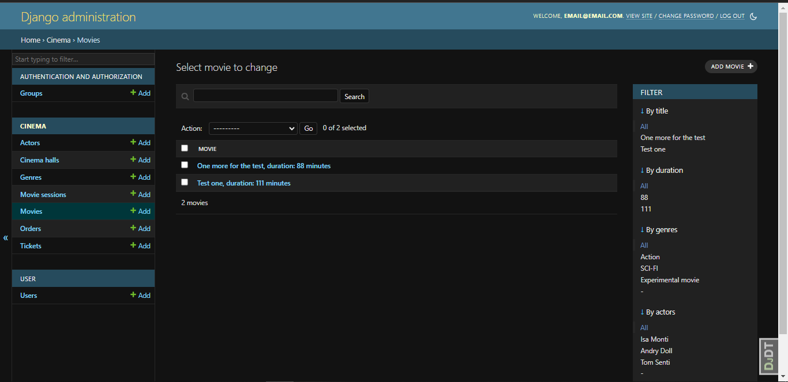
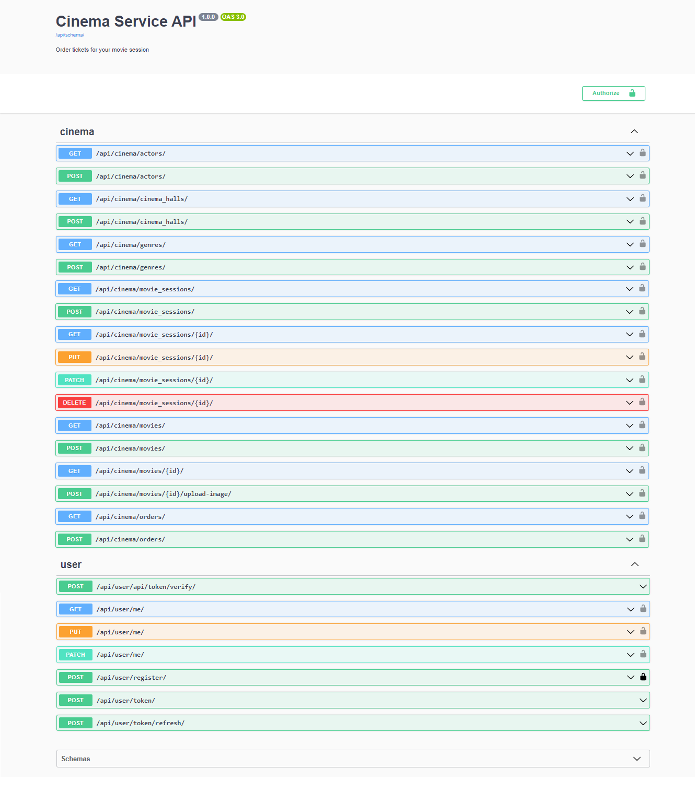

# CineMagic API
___
#### API Service for cinema management created using Django REST Framework, PostgreSQL database, and Docker. Welcome to experience ease in using this backend starting from user registration till orders creation for standard users and additional features for movies, actors, genres, movie sessions management, and cinema hall options for admin users.  

### 💾 Installation:
___
#### 1. Clone the repository:
```shell
git clone https://github.com/bohdan-yatsyna/CineMagic-API.git
cd cinema-service-API
```
#### 2. Create and activate a virtual environment with requirements installed:
🖥 Windows:
```shell
python -m venv venv
venv\Scripts\activate
```
💻 Linux/MacOS:
```shell
python -m venv venv
source venv/bin/activate
```
#### 3. 🗝 Set up environment variables (using .env):
- Create an empty .env file in the root folder of the project.
- Copy the entire content of the .env.sample to your .env file.
- Modify the placeholders in the .env file with your preferred environment variables.

#### 4. 🐳 Run it with DOCKER:
- DOCKER should be installed and opened.
```shell
docker-compose up --build
```
- And open in your browser "http://127.0.0.1:8000/"

#### 🗝 For creating an admin user:  
- Check the actual container ID of the application with ```docker ps```  
- Enter it to the next command and run ```docker exec -it <container_id> python manage.py createsuperuser```  

#### 🗝 For creating standard user next endpoints will help:  
- **User creating** - send a POST request to /api/user/register/   
- **Obtain token** - send a POST request to /api/user/token/  

# 🧾 Features
___
- JWT authentication 🔒
- Admin panel /admin/ with opportunity for further customization
- Detailed Documentation on /api/doc/swagger/
- Managing orders and tickets
- Creating movies with genres, actors
- Creating cinema halls
- Adding movie sessions
- Filtering movies and movie sessions


# 🕶 DEMO
### Admin pannel:


### Documentation with all endpoints:

